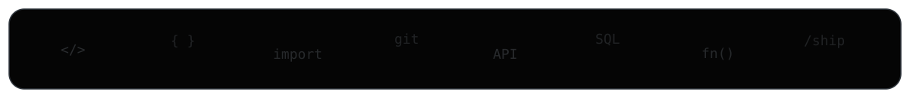

## About

**Computer Science and Technology graduate from SNS College of Engineering.** I focus on Python backends, REST APIs, relational data systems and React-based full-stack products, with a growing focus on system design.

## Tech Stack

<code>Python</code> · <code>FastAPI</code> · <code>Django</code> · <code>Flask</code> · <code>React</code> · <code>JavaScript</code> · <code>HTML</code> · <code>CSS</code> · <code>Tailwind CSS</code> · <code>SQL</code> · <code>MySQL</code> · <code>REST APIs</code> · <code>Git</code> · <code>GitHub</code>

## Activity

  

  

## Contributions

<picture><source media="(prefers-color-scheme: dark)" srcset="https://raw.githubusercontent.com/Raahin-SUhail/Raahin-SUhail/output/github-snake-dark.svg"/><source media="(prefers-color-scheme: light)" srcset="https://raw.githubusercontent.com/Raahin-SUhail/Raahin-SUhail/output/github-snake.svg"/></picture>

## Education
**SNS College of Engineering** · **BE — Computer Science and Technology**

## Certifications
`Salesforce AgenticAI` · `OCI AI Foundations` · `Python Programming` · `Databricks GenAI` · `AWS Cloud Practitioner Essentials` · `Generative Models for Developers — Infosys`

 <code>build() → learn() → ship() → repeat()</code>

