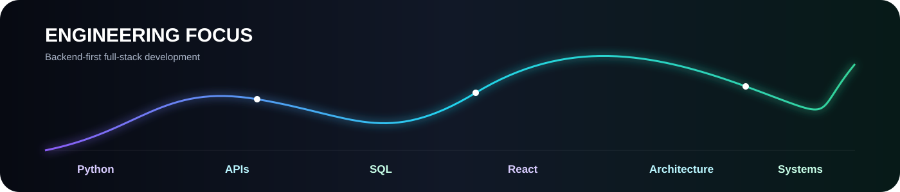
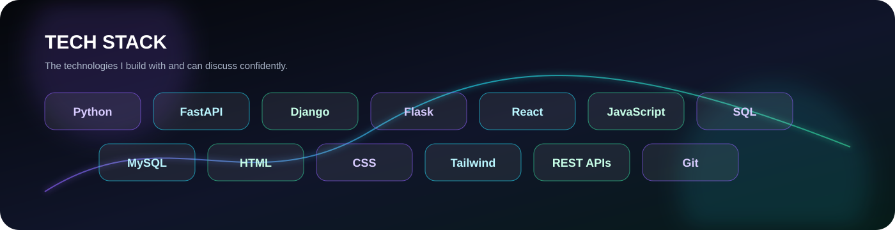

<strong>Python Full Stack Developer</strong> · Backend Engineering · API Development · System Design

 

## 👨‍💻 About Me

I'm **Raahin Suhail**, a **Computer Science and Technology graduate from SNS College of Engineering** focused on Python full-stack development.

My primary direction is **backend engineering** — building REST APIs, working with relational databases, designing application workflows, and connecting them to modern React interfaces.

> **Python → APIs → Data → React → Systems**

## ⚡ Technology Stack

### Languages
`Python` · `JavaScript` · `SQL`

### Backend
`FastAPI` · `Django` · `Flask`

### Frontend
`React` · `HTML` · `CSS` · `Tailwind CSS`

### Data & APIs
`MySQL` · `SQLite` · `REST APIs` · `Postman`

### Tools
`Git` · `GitHub` · `Docker`

## 📊 GitHub Activity

  

  

## 🎓 Education

**SNS College of Engineering**  
**BE — Computer Science and Technology**

## 📜 Certifications

`Salesforce AgenticAI` · `OCI AI Foundations` · `Python Programming` · `Databricks GenAI` · `AWS Cloud Practitioner Essentials` · `Generative Models for Developers — Infosys`

## 🎯 Current Focus

`Backend Engineering` · `REST API Architecture` · `SQL & Data Modeling` · `React Full Stack` · `Low-Level System Design`

### `build()` → `learn()` → `ship()` → `repeat()`

 

**Thanks for visiting. 🚀**

