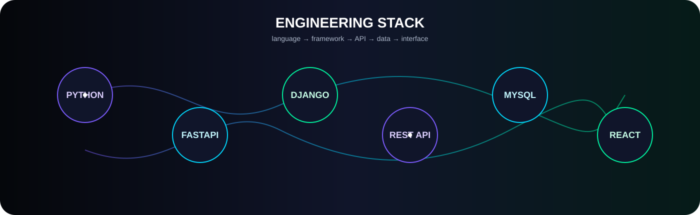

<strong>PYTHON FULL STACK DEVELOPER</strong> · BACKEND · APIS · SYSTEMS

 

## ⚡ STACK

`Python` · `FastAPI` · `Django` · `Flask` · `React` · `JavaScript` · `HTML` · `CSS` · `Tailwind CSS` · `SQL` · `MySQL` · `REST APIs` · `Git` · `GitHub`

 

## 👨‍💻 ABOUT

**Computer Science and Technology graduate from SNS College of Engineering.**

I focus on building Python backends, REST APIs, relational data systems and React-based full-stack products — with a growing focus on system design.

## 📊 ACTIVITY

  

  

## 🐍 CONTRIBUTIONS

<picture>
  <source media="(prefers-color-scheme: dark)" srcset="https://raw.githubusercontent.com/Raahin-SUhail/Raahin-SUhail/output/github-snake-dark.svg" />
  <source media="(prefers-color-scheme: light)" srcset="https://raw.githubusercontent.com/Raahin-SUhail/Raahin-SUhail/output/github-snake.svg" />
  
</picture>

## 🎓 EDUCATION

**SNS College of Engineering** · **BE — Computer Science and Technology**

## 📜 CERTIFICATIONS

`Salesforce AgenticAI` · `OCI AI Foundations` · `Python Programming` · `Databricks GenAI` · `AWS Cloud Practitioner Essentials` · `Generative Models for Developers — Infosys`

### `build()` → `learn()` → `ship()` → `repeat()`

