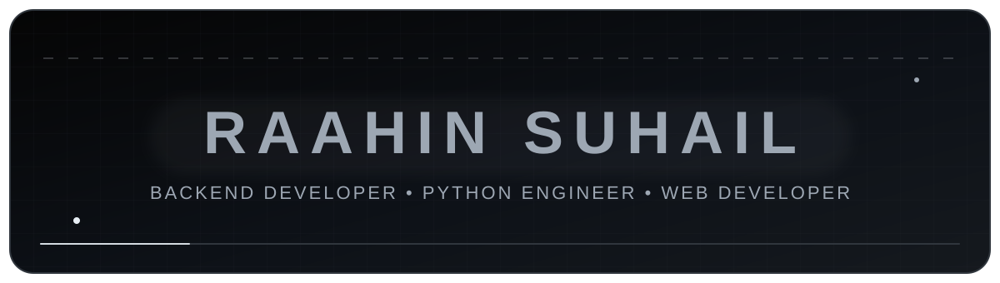

 

## TECHNOLOGY STACK

## CONTRIBUTIONS

<picture>
<source media="(prefers-color-scheme: dark)" srcset="https://raw.githubusercontent.com/Raahin-SUhail/Raahin-SUhail/output/github-snake-dark.svg"/>
<source media="(prefers-color-scheme: light)" srcset="https://raw.githubusercontent.com/Raahin-SUhail/Raahin-SUhail/output/github-snake.svg"/>

</picture>

<table>
<tr>
<td width="50%" valign="top">

### EDUCATION

**SNS College of Engineering**  
B.E. — Computer Science and Technology

</td>
<td width="50%" valign="top">

### CERTIFICATIONS

- Salesforce AgenticAI
- OCI AI Foundations
- Python Programming
- Databricks Generative AI
- AWS Cloud Practitioner Essentials
- Generative Models for Developers — Infosys

</td>
</tr>
</table>

Profile design contribution by <a href="https://github.com/ROSHAN-1211">Roshan Suhail</a>

  

